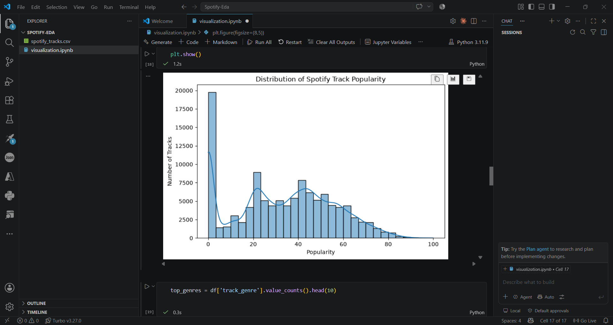
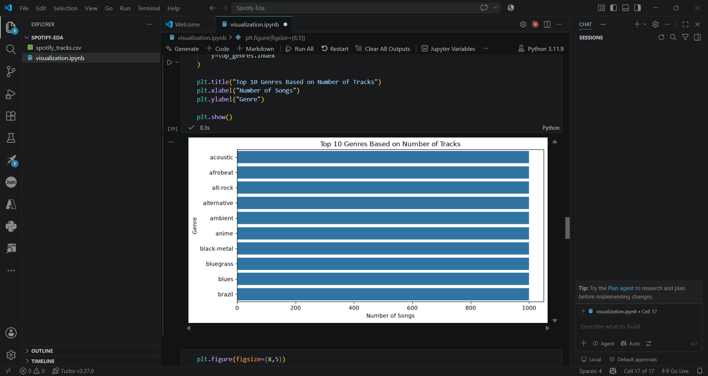

# Spotify Tracks Dataset - EDA & Visualization

## Dataset Overview

The Spotify Tracks Dataset contains information about songs including audio features, popularity, artists, genres, and track characteristics.

## Technologies Used

- Python
- Pandas
- Matplotlib
- Seaborn
- Jupyter Notebook

## Visualizations

### 1. Popularity Distribution

Insight:
Most tracks have moderate popularity.

### 2. Top Genres

Insight:
Some genres have higher representation.

## Key Findings

- Genre distribution is uneven.
- Popularity depends on multiple factors.
- Audio features show interesting relationships.

## Conclusion

EDA helped identify patterns in Spotify music characteristics and understand how different attributes relate to popularity.