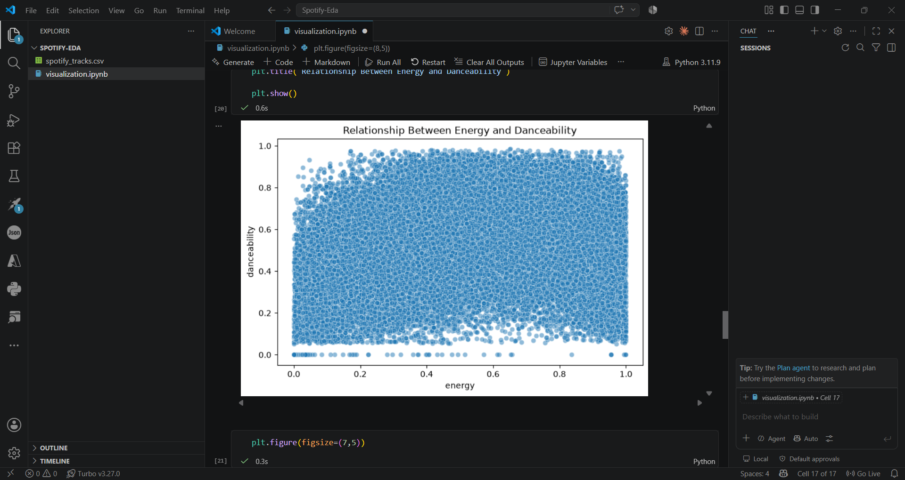
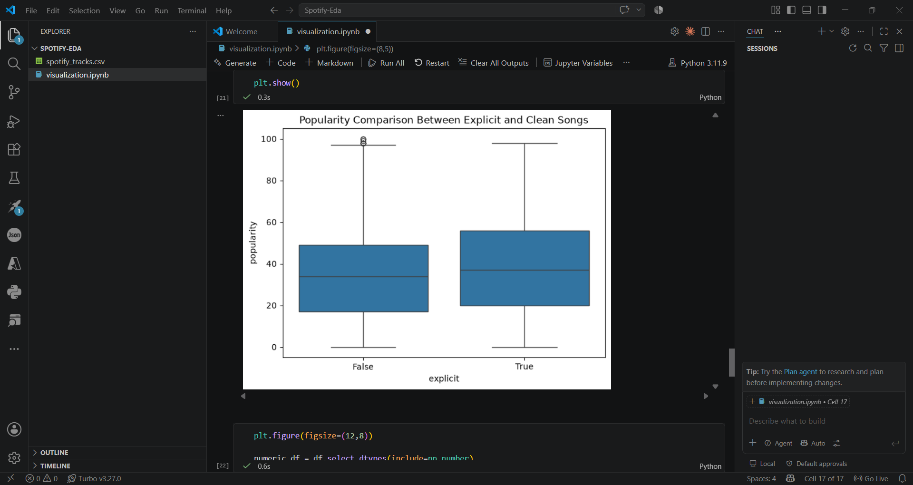
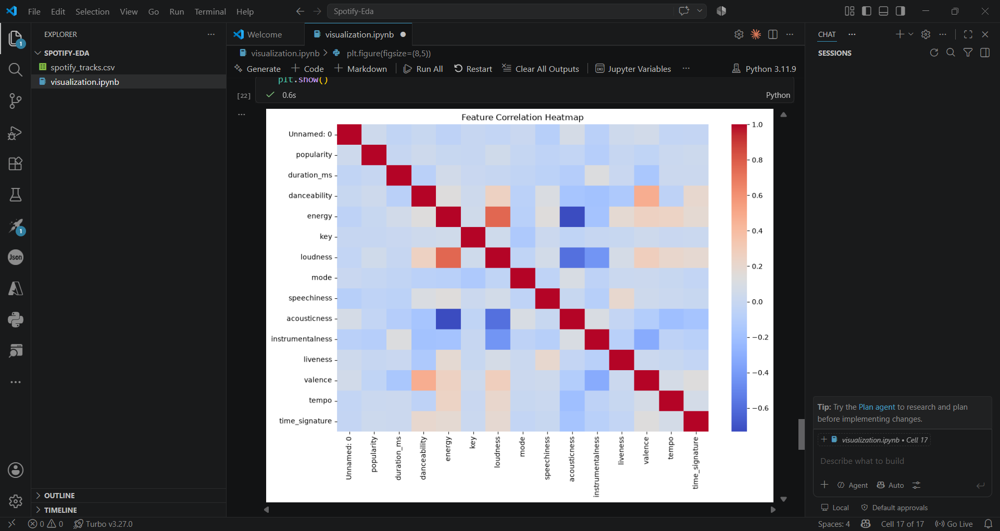
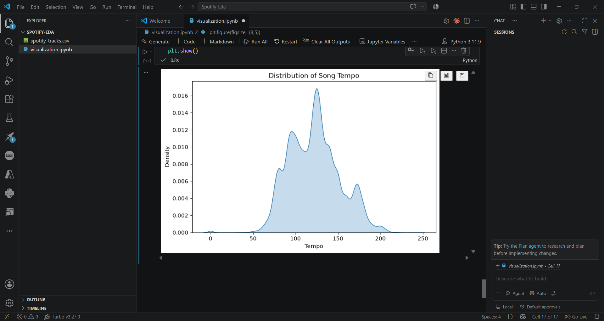

# Spotify Tracks Dataset - EDA & Visualization

## Dataset Overview

The Spotify Tracks Dataset contains information about songs including audio features, popularity, artists, genres, and track characteristics.

## Technologies Used

- Python
- Pandas
- Matplotlib
- Seaborn
- Jupyter Notebook

## Visualizations

### 1. Popularity Distribution

Insight:
Most tracks have moderate popularity.

### 2. Top Genres

Insight:
Some genres have higher representation.

### 3. Energy vs Danceability

**Insight:**
There is a positive relationship between energy and danceability. Songs with higher energy levels are generally more danceable, though there are some exceptions.

---

### 4. Popularity by Explicit Content

**Insight:**
The popularity distribution differs between explicit and non-explicit tracks, suggesting that explicit content alone does not determine a song's success.

---

### 5. Correlation Heatmap

**Insight:**
Features such as energy, loudness, and danceability exhibit noticeable correlations, while popularity has relatively weak correlations with most individual audio features.

---

### 6. Tempo Distribution

**Insight:**
Most tracks fall within a moderate tempo range, indicating that songs with extremely slow or extremely fast tempos are comparatively less common in the dataset.

## Key Findings

- Genre distribution is uneven.
- Popularity depends on multiple factors.
- Audio features show interesting relationships.

## Conclusion

EDA helped identify patterns in Spotify music characteristics and understand how different attributes relate to popularity.
